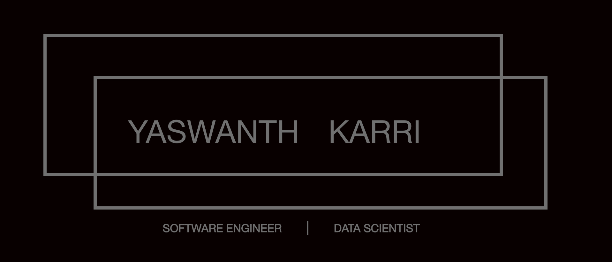

## Hi there, I'm [Yaswanth Karri](https://www.linkedin.com/in/yaswanthk5594/) </h2>

</a>

 
 

### 👨🏻‍💻 &nbsp;About Me

🎓 &nbsp; I am a Graduate student in Data Science at Indiana University, Bloomington.\
📈 &nbsp;Almost 5 years of hands-on working experience on Programming languages, Databases , Data Analysis and Machine Learning.\
🌱 &nbsp;I'm on track for learning more about Data Engineering , Web development and Cloud Architecture.\
✉️ &nbsp;You can shoot me an email at yaswanth.k0594@gmail.com! I'll try to respond as soon as I can.

😄 Pronouns: he/him

### 🛠 &nbsp;Tech Stack

<table >
    <tr>
        <td>
        <table>
            <tr>
                <td><h4>📈 Skill set</h4></td>
            </tr>
            <tr>
                <td><li><b>Programming Languages: </b>Python, R, Javascript, SAP ABAP , C</li>
                <li><b>Databases: </b>MySQL, PostgreSQL, MongoDB (NoSQL)</li>
                <li><b>Data Visualization: </b>Tableau, Shiny, Matplotlib, Seaborn , ggplot2</li>
                <li><b>Libraries: </b>Pandas, Numpy, Scikit-learn, tidyverse, , dplyr, Tensorflow, Keras, Beautiful Soup</li>
                <li><b>Framework/Tools: </b>Pytorch, React, Git, MS Office, Apache Airflow,Jupyter Notebooks</li>
                <li><b>DevOps Tools: </b>Docker</li>
                <li><b>Machine Learning: </b>Classification, Regression, Clustering, Neural Networks, Ensemble Learning, Forecasting, Dimension Reduction, Predictive modeling, CNN, GAN</li>
                </td>
            </tr>
        </table>
        </td>
    </tr> 
</table>
